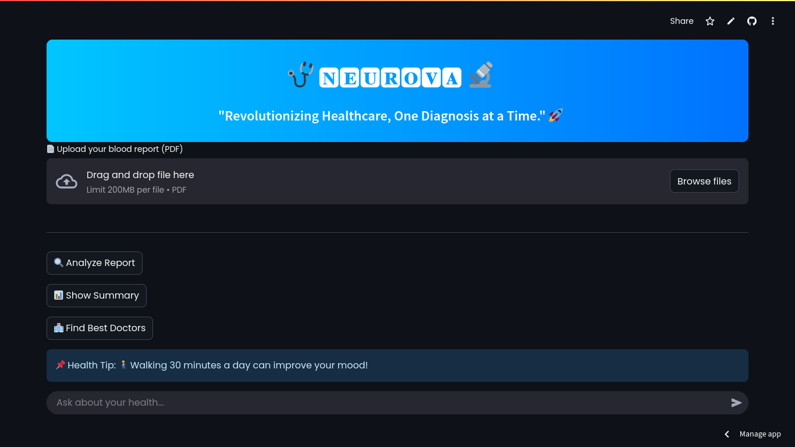

# 🚀 Neurova AI - Revolutionizing Healthcare with AI  
### **Your AI-Powered Health Companion**  

Neurova AI is an **AI-driven medical assistant** that can **analyze blood test reports, provide medical insights, and answer your health-related questions intelligently!**  

  

---

## 📌 **Key Features**  
✅ **📄 Upload & Analyze Blood Test Reports** – AI extracts insights from PDF blood test reports.  
✅ **💬 AI Medical Chatbot** – Ask about symptoms, medical conditions, or general health advice.  
✅ **📍 Find Nearby Doctors** – Quickly locate the best doctors in your area.  
✅ **📊 Blood Test Data Visualization** – View blood test analysis through **Bubble & Gauge Charts**.  
✅ **💡 Random Health Tips** – Receive useful health tips every time you open the app.  
✅ **🌐 Interactive Footer** – Direct links to **YouTube, Instagram, and GitHub** for more updates.  

---

## 🔧 **Installation & Setup Guide**  

### 1️⃣ **Clone the Repository & Navigate to the Project Directory**  
```bash
git clone https://github.com/Farrel0xx/Neurova.git
cd Neurova
```

### 2️⃣ **Create a Virtual Environment & Install Dependencies**  
```bash
python -m venv env
source env/bin/activate  # (Mac/Linux)
env\Scripts\activate     # (Windows)
pip install -r requirements.txt
```

### 3️⃣ **Set Up API Keys in `secrets.toml`**  
Open `secrets.toml` in the `.streamlit/` folder and add your API keys:  

```toml
GEMINI_API_KEY = "your_gemini_api_key"
SERPER_API_KEY = "your_serper_api_key"
GROQ_API_KEY = "your_groq_api_key"
```

### 4️⃣ **Run the Application**  
```bash
streamlit run app.py
```

---

## 🎨 **Tech Stack**  
🔹 **Frontend**: Streamlit (Python)  
🔹 **AI Processing**: Gemini, Groq, or Serper APIs  
🔹 **Data Visualization**: Plotly  
🔹 **PDF Processing**: PyMuPDF (fitz)  

---

## 🤝 **Contributing**  
Contributions are welcome! Feel free to fork this repo, create a new branch, and submit a pull request.  

---

## 📞 **Contact & Support**  
📧 **Email**: ghost404sec@gmail.com  
🌐 **Website**: [Neurova AI Website](https://neurova.streamlit.app)  
🔗 **GitHub**: [Neurova AI Repo](https://github.com/Farrel0xx/neurova-ai)  

---
🚀 **Made with ❤️ by [Farrel0xx](https://github.com/Farrel0xx)**  
